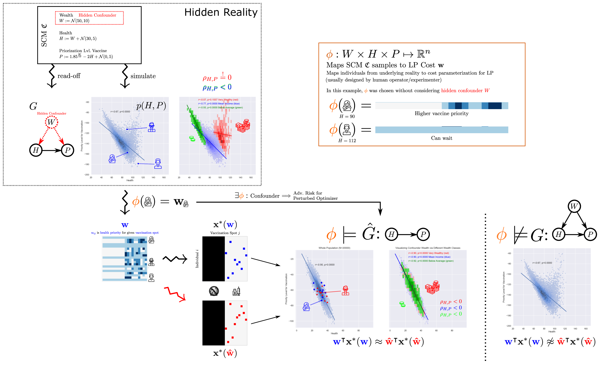

### Hidden Confounder Attacks

##### Adversarial Attacks Are Not a Privilege of Deep Learning

[Matej Zečević](https://ml-research.github.io/people/mzecevic/), [Devendra Singh Dhami](https://ml-research.github.io/people/ddhami/), [Kristian Kersting](https://ml-research.github.io/people/kkersting/index.html).

Official code repository to the corresponding [paper](https://arxiv.org/abs/2105.12697).

Abstract:

> In recent years there has been a lot of focus on adversarial attacks, especially on deep neural networks. Here, we argue that they are more general in nature and can easily affect a larger class of models, e.g., any differentiable perturbed optimizers. We further show that such attacks can be determined by the hidden confounders in a domain, thus drawing a novel connection between such attacks and causality. Establishing this causal perspective is characterized by the influence of the structural causal model's data generating process on the subsequent optimization thereby exhibiting intriguing parameters of the former. We reveal the existence of such parameters for three combinatorial optimization problems, namely linear assignment, shortest path and a real world problem of energy systems. Our empirical examination also unveils worrisome consequences of these attacks on differentiable perturbed optimizers thereby highlighting the criticality of our findings.

